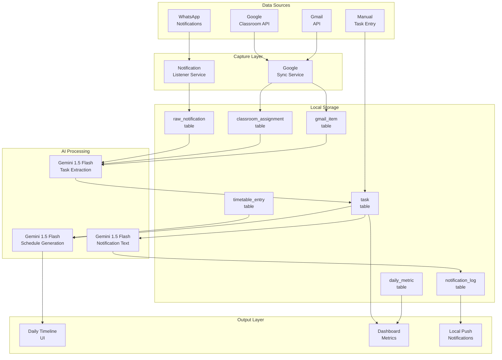

# 🧠 SIA — Smart Intelligent Assistant
## Master Blueprint v1.0
> **Status:** 🟡 Awaiting Approval  
> **Last Updated:** 2026-08-11  
> **Author:** @pm → @architect → @uiux (Autonomous Pipeline)

---

# PART 1: BUSINESS REQUIREMENTS DOCUMENT (BRD)
*— @pm (Product Manager) —*

---

## 1.1 Executive Summary

**SIA (Smart Intelligent Assistant)** is a 100% free-to-operate, AI-powered daily planning application designed exclusively for Indian college students. SIA acts as a personal academic operations center that:

1. **Intercepts** WhatsApp group notifications (class groups, project groups) in real-time via Android's Notification Listener Service.
2. **Fetches** assignments, deadlines, and announcements from Google Classroom and Gmail using read-only OAuth2 scopes.
3. **Processes** all captured data through the Google Gemini 1.5 Flash API to extract actionable tasks, deadlines, and priorities.
4. **Schedules** intelligent, context-aware local push notifications that remind students of upcoming deadlines, suggest optimal study blocks, and flag conflicts.

**Core Value Proposition:** "SIA turns your chaotic WhatsApp class groups and scattered Google Classroom assignments into a clean, AI-curated daily timeline — completely free, completely offline-capable, and completely private."

**Zero-Cost Commitment:** SIA uses no paid backend (no Firebase Firestore, no cloud databases). All data is stored locally on the device using SQLite. The only external API call is to Google's free-tier Gemini 1.5 Flash API.

---

## 1.2 User Personas

### Persona 1: The Overwhelmed First-Year ("Arjun")
| Attribute | Detail |
|---|---|
| **Age** | 18–19 |
| **Tech Savvy** | Moderate (Android user, heavy WhatsApp usage) |
| **Pain Point** | Drowning in 8+ WhatsApp class groups. Misses assignment deadlines because announcements get buried under memes. |
| **Goal** | A single app that extracts deadlines from WhatsApp noise and reminds him proactively. |
| **Success Metric** | Reduces missed deadlines from ~4/month to 0. |

### Persona 2: The Ambitious Overachiever ("Priya")
| Attribute | Detail |
|---|---|
| **Age** | 20–21 |
| **Tech Savvy** | High (uses Google Classroom, multiple email accounts) |
| **Pain Point** | Manually checks Classroom + Gmail + WhatsApp 20+ times/day. Wants AI to time-block her day automatically. |
| **Goal** | AI-generated daily schedule that accounts for Classroom deadlines, WhatsApp announcements, and personal study time. |
| **Success Metric** | Saves 45+ minutes/day previously spent on manual planning. |

### Persona 3: The Procrastinator ("Rahul")
| Attribute | Detail |
|---|---|
| **Age** | 19–22 |
| **Tech Savvy** | Low-Moderate |
| **Pain Point** | Knows about deadlines but ignores them until the last minute. Needs aggressive, well-timed nudges. |
| **Goal** | Persistent, escalating notifications that adapt to his behavior ("You have 6 hours left for the OS assignment. Start now."). |
| **Success Metric** | Increases early-start rate from 10% to 60%. |

---

## 1.3 User Stories & Acceptance Criteria

### Epic 1: Authentication & Onboarding

| ID | User Story | Acceptance Criteria | Priority |
|---|---|---|---|
| US-01 | As a student, I want to sign in with my Google account so that SIA can access my Classroom and Gmail. | - Google Sign-In OAuth2 flow completes successfully. <br>- Read-only scopes for Classroom and Gmail are granted. <br>- User profile (name, email, avatar) is stored locally via `shared_preferences`. | P0 |
| US-02 | As a student, I want to set up my college timetable during onboarding so that SIA knows my class schedule. | - Timetable editor allows adding: Subject, Day, Start Time, End Time, Room. <br>- Data persists in local SQLite DB. <br>- Timetable is editable after initial setup. | P0 |
| US-03 | As a student, I want to grant notification listener permission so that SIA can read WhatsApp notifications. | - Android Notification Listener permission dialog is shown. <br>- Permission state is tracked and re-prompted if revoked. <br>- Clear explanation of why the permission is needed. | P0 |

### Epic 2: Data Ingestion & AI Processing

| ID | User Story | Acceptance Criteria | Priority |
|---|---|---|---|
| US-04 | As a student, I want SIA to intercept my WhatsApp group notifications and extract deadlines/tasks. | - Notification Listener runs as a foreground service. <br>- Only notifications from `com.whatsapp` are intercepted. <br>- Raw notification text (title, body, timestamp) is stored in SQLite `raw_notifications` table. <br>- Duplicate notifications are deduplicated by content hash. | P0 |
| US-05 | As a student, I want SIA to fetch my Google Classroom assignments so I never miss a deadline. | - Classroom API (`courses.list`, `courseWork.list`) is called on app launch + every 30 minutes. <br>- Assignment title, description, due date, and course name are stored locally. <br>- Only new/updated assignments since last sync are fetched (delta sync). | P0 |
| US-06 | As a student, I want SIA to scan my Gmail inbox for academic emails (deadline reminders, faculty announcements). | - Gmail API (`messages.list`) is called with query filter: `is:unread label:inbox`. <br>- Only emails from the last 7 days are fetched. <br>- Email subject, snippet, sender, and date are stored locally. | P1 |
| US-07 | As a student, I want SIA to run all captured data through Gemini AI to extract actionable tasks with deadlines. | - Gemini 1.5 Flash API is called with a structured prompt containing: raw WhatsApp texts, Classroom assignments, and Gmail snippets. <br>- AI returns a JSON array of tasks: `{title, description, deadline, priority, source}`. <br>- Malformed AI responses are gracefully handled with retry logic (max 2 retries). <br>- Tasks are stored in the `tasks` table in SQLite. | P0 |

### Epic 3: Smart Schedule & Time-Blocking

| ID | User Story | Acceptance Criteria | Priority |
|---|---|---|---|
| US-08 | As a student, I want SIA to generate a daily timeline that merges my timetable, AI-extracted tasks, and personal blocks. | - Timeline view shows hour-by-hour blocks for the current day. <br>- Fixed blocks (classes from timetable) are non-editable and color-coded. <br>- AI-suggested task blocks are editable (drag, resize, delete). <br>- Conflicts are visually highlighted in red. | P0 |
| US-09 | As a student, I want to manually add/edit/delete tasks so I can supplement the AI's suggestions. | - CRUD operations on the `tasks` table via the UI. <br>- Manual tasks are distinguishable from AI-generated tasks (icon/tag). <br>- Deleted tasks are soft-deleted (recoverable). | P0 |
| US-10 | As a student, I want to mark tasks as complete so SIA tracks my productivity. | - Tap-to-complete with a satisfying animation. <br>- Completed tasks are moved to a "Done" section. <br>- Completion rate is tracked as a daily metric. | P1 |

### Epic 4: Intelligent Notifications

| ID | User Story | Acceptance Criteria | Priority |
|---|---|---|---|
| US-11 | As a student, I want SIA to send me proactive notifications before deadlines. | - Notifications are scheduled at: 24h, 6h, 1h, and 15min before a deadline. <br>- Notification text is AI-generated and contextual (e.g., "Your DBMS assignment is due in 6 hours. You haven't started yet."). <br>- Notifications use `flutter_local_notifications` with Android channels. | P0 |
| US-12 | As a student, I want notifications to escalate if I keep ignoring them. | - If a notification is dismissed without action, a follow-up is sent 30 minutes later with increased urgency. <br>- Maximum 3 escalations per task. <br>- Escalation text is AI-generated. | P1 |

### Epic 5: Dashboard & Analytics

| ID | User Story | Acceptance Criteria | Priority |
|---|---|---|---|
| US-13 | As a student, I want a dashboard showing today's overview, pending tasks, and completion metrics. | - Dashboard shows: current time block, next 3 upcoming tasks, tasks completed today, and an overall "SIA Score" (productivity metric). <br>- Data refreshes on pull-down. | P0 |
| US-14 | As a student, I want to see a weekly productivity summary so I can track my improvement. | - Weekly bar chart showing tasks completed per day. <br>- Trend indicator (up or down compared to last week). <br>- Data sourced entirely from local SQLite. | P2 |

### Epic 6: Personal Goals Management

| ID | User Story | Acceptance Criteria | Priority |
|---|---|---|---|
| US-15 | As a student, I want to create personal goals (e.g., "Study 2 hours of DSA daily", "Complete ML course by Oct") so that SIA can plan my day around them. | - Goal creation form with: title, category (ACADEMIC, FITNESS, SKILL, PERSONAL), target type (DAILY_HABIT, WEEKLY_TARGET, DEADLINE_GOAL), target value, unit, and optional deadline. <br>- Goals persist in local SQLite `goal` table. <br>- Goals are editable and archivable. | P0 |
| US-16 | As a student, I want SIA's AI to factor my active goals into the daily schedule it generates. | - Gemini prompt includes active goals with their daily/weekly targets. <br>- AI allocates time blocks for goal-related activities (e.g., "DSA Practice" block). <br>- Goal-linked schedule blocks are color-coded with a goal badge. | P0 |
| US-17 | As a student, I want to log progress against my goals so SIA knows what I've achieved. | - Quick-log button on goal cards: tap to log today's progress (e.g., "1.5 hours studied"). <br>- Progress is stored in `goal_progress` table with date and value. <br>- Progress bar shows daily/weekly completion percentage. | P0 |
| US-18 | As a student, I want SIA to nudge me about goals I'm falling behind on. | - If a daily habit goal has no progress logged by 6 PM, send a reminder notification. <br>- If a weekly target is <50% complete by Thursday, send a mid-week alert. <br>- Notification text is AI-generated and motivating. | P1 |

### Epic 7: Consistency Tracking & Streaks

| ID | User Story | Acceptance Criteria | Priority |
|---|---|---|---|
| US-19 | As a student, I want to see my consistency streak (how many consecutive days I've completed my goals/tasks) so I'm motivated to maintain it. | - Streak counter shows current streak (days) and longest streak. <br>- A streak is maintained if the user completes at least 1 task AND logs progress on at least 1 active goal per day. <br>- Streak data is stored in `consistency_streak` table. <br>- Streak resets at midnight if conditions aren't met for the previous day. <br>- Visual flame/fire icon that grows with longer streaks. | P0 |
| US-20 | As a student, I want a GitHub-style contribution heatmap showing my activity over the past 3 months so I can visualize my consistency patterns. | - 90-day heatmap grid (rows = days of week, columns = weeks). <br>- Cell intensity based on SIA Score for that day (0 = empty, 1-25 = light, 26-50 = medium, 51-75 = strong, 76-100 = intense). <br>- Tappable cells show day's summary (tasks done, goals progressed, SIA Score). <br>- Heatmap is sourced from `daily_metric` table. | P1 |

---

## 1.4 Non-Functional Requirements (NFRs)

| Category | Requirement | Target |
|---|---|---|
| **Performance** | App cold-start time | < 2 seconds |
| **Performance** | Gemini API response time | < 3 seconds (with timeout fallback) |
| **Performance** | Local DB query time | < 100ms for any single query |
| **Storage** | App size (installed) | < 30 MB |
| **Storage** | Local database cap | Auto-prune data older than 30 days |
| **Security** | OAuth2 tokens | Stored in Android Keystore, never in SharedPreferences |
| **Security** | Gemini API key | Stored in `--dart-define` at build time, never hardcoded |
| **Privacy** | WhatsApp data | All notification data stays on-device. Zero cloud uploads. |
| **Privacy** | Google data | Only read-only scopes. SIA never modifies Classroom/Gmail. |
| **Reliability** | Background service | Notification listener survives app kill (foreground service). |
| **Compatibility** | Android version | Minimum SDK 26 (Android 8.0), Target SDK 34 (Android 14). |
| **Offline** | Core functionality | Timetable, manual tasks, and cached schedule work fully offline. AI features degrade gracefully (show cached results). |

---

## 1.5 Edge Cases & Error Handling Matrix

| Scenario | Expected Behavior |
|---|---|
| User denies notification listener permission | Show persistent banner on dashboard: "Enable notification access to unlock WhatsApp integration." Link to settings. |
| User revokes Google OAuth scopes | Detect on next API call. Show re-auth prompt. Cached Classroom data remains available. |
| Gemini API returns malformed JSON | Retry up to 2 times with exponential backoff. If still failing, log the raw response and show "AI temporarily unavailable" toast. Use last cached tasks. |
| Gemini API rate limit exceeded | Queue the request. Retry after 60 seconds. Show "Processing your tasks..." indicator. |
| No internet connectivity | All offline features work normally. AI and Google sync show "Waiting for connection" badge. Auto-retry on reconnect. |
| WhatsApp sends duplicate notifications | Deduplicate by SHA-256 hash of `packageName + title + text + timestamp(within 2min window)`. |
| User has 0 Classroom courses | Show empty state: "No courses found. Make sure you're enrolled in Google Classroom." |
| SQLite database corruption | Detect via integrity check on startup. If corrupt, backup and recreate tables. Show "SIA recovered from a data issue" notification. |
| Device restarts | Re-register all scheduled notifications via `BOOT_COMPLETED` broadcast receiver. |
| Battery optimization kills background service | Detect via periodic health check. Prompt user to disable battery optimization for SIA. |
| User creates a goal with no measurable target | Validation prevents saving. Show: "Add a target value so SIA can track your progress." |
| User logs goal progress exceeding target | Accept the log. Show congratulatory toast: "You exceeded your target! Keep it up." Cap the progress bar at 100% but show actual value. |
| Streak calculation across timezone change | Streak is calculated based on device local time. Midnight boundary uses the timezone set at streak start. |
| User has 0 active goals | Goals section shows empty state: "Set your first goal and let SIA help you stay on track." AI schedule generation skips goal blocks. |

---

## 1.6 Success Metrics (KPIs)

| Metric | Target | Measurement |
|---|---|---|
| **Daily Active Usage** | User opens SIA at least 2x/day | Local analytics counter |
| **Task Capture Rate** | At least 90% of WhatsApp deadlines are extracted correctly | Manual audit of 50 sample notifications |
| **Notification Action Rate** | At least 40% of notifications result in task completion within 2 hours | Local event tracking |
| **Deadline Miss Rate** | Reduction of at least 70% compared to pre-SIA baseline | User self-reported survey |
| **App Retention (7-day)** | At least 60% of users return after Day 7 | Local first-launch + day-7 check |
| **Goal Completion Rate** | At least 50% of daily habit goals are marked as done each day | Local goal_progress query |
| **Average Streak Length** | At least 5 consecutive days for active users | Local consistency_streak query |
| **Consistency Heatmap Engagement** | At least 30% of users view the heatmap weekly | Local analytics counter |

---
---

# PART 2: SYSTEMS ARCHITECTURE
*— @architect (Systems Architect) —*

---

## 2.1 Technology Stack (Zero-Cost, All-Local)

| Layer | Technology | Rationale |
|---|---|---|
| **Framework** | Flutter 3.x (Dart 3+, Null Safety) | Cross-platform, but SIA targets Android-only for notification listener. |
| **State Management** | `flutter_riverpod` (with Riverpod Generator + hooks) | Compile-safe, testable, supports async providers natively. |
| **AI Engine** | `google_generative_ai` (Gemini 1.5 Flash) | Free tier, fast, supports structured JSON output mode. |
| **Local Database** | `sqflite` | Mature SQLite wrapper. No cloud dependency. |
| **Key-Value Store** | `shared_preferences` | User profile, settings, onboarding state. |
| **WhatsApp Listener** | `flutter_notification_listener_plus` | Android NotificationListenerService wrapper with background isolate support. |
| **Google Auth** | `google_sign_in` | Standard Google OAuth2 for Android. |
| **Google APIs** | `googleapis` (Classroom v1, Gmail v1) | Official Google API client. Read-only scopes only. |
| **Notifications** | `flutter_local_notifications` | Scheduled, channeled, Android 13+ permission-aware. |
| **Routing** | `go_router` | Declarative, deep-link ready. |
| **Date/Time** | `intl` + Dart's `DateTime` | Timezone-aware formatting. |
| **Code Generation** | `freezed`, `json_serializable`, `riverpod_generator` | Immutable models, JSON serialization, type-safe providers. |
| **Build Runner** | `build_runner` | Code generation orchestrator. |

---

## 2.2 Entity-Relationship Diagram (ERD)

```mermaid
erDiagram
    USER_PROFILE {
        TEXT google_id PK "Google Account ID"
        TEXT display_name "User display name"
        TEXT email "User email"
        TEXT photo_url "Avatar URL"
        TEXT college_name "Optional college name"
        INTEGER onboarding_complete "0 or 1"
        TEXT created_at "ISO8601 timestamp"
        TEXT updated_at "ISO8601 timestamp"
    }

    TIMETABLE_ENTRY {
        INTEGER id PK "Auto-increment"
        TEXT subject "e.g. Data Structures"
        TEXT day_of_week "MONDAY to SUNDAY"
        TEXT start_time "HH:mm"
        TEXT end_time "HH:mm"
        TEXT room "Optional room or building"
        TEXT teacher "Optional faculty name"
        INTEGER is_active "0 or 1 default 1"
        TEXT created_at "ISO8601"
    }

    RAW_NOTIFICATION {
        INTEGER id PK "Auto-increment"
        TEXT package_name "e.g. com.whatsapp"
        TEXT title "Notification title - group name"
        TEXT body "Notification body - message"
        TEXT content_hash "SHA-256 for dedup"
        INTEGER is_processed "0 or 1"
        TEXT received_at "ISO8601"
    }

    CLASSROOM_ASSIGNMENT {
        INTEGER id PK "Auto-increment"
        TEXT classroom_id "Google Classroom course ID"
        TEXT course_name "e.g. DBMS Lab"
        TEXT assignment_id "Google Classroom assignment ID"
        TEXT title "Assignment title"
        TEXT description "Assignment description"
        TEXT due_date "ISO8601 or null"
        TEXT link "URL to assignment"
        TEXT state "ACTIVE or TURNED_IN or RETURNED"
        TEXT last_synced_at "ISO8601"
    }

    GMAIL_ITEM {
        INTEGER id PK "Auto-increment"
        TEXT message_id "Gmail message ID"
        TEXT from_address "Sender email"
        TEXT subject "Email subject"
        TEXT snippet "Preview text"
        TEXT received_at "ISO8601"
        INTEGER is_processed "0 or 1"
        TEXT last_synced_at "ISO8601"
    }

    TASK {
        INTEGER id PK "Auto-increment"
        TEXT title "Task title"
        TEXT description "Task details"
        TEXT source "WHATSAPP or CLASSROOM or GMAIL or MANUAL"
        INTEGER source_id "FK to source table or null"
        TEXT priority "CRITICAL or HIGH or MEDIUM or LOW"
        TEXT deadline "ISO8601 or null"
        TEXT scheduled_start "ISO8601 or null"
        TEXT scheduled_end "ISO8601 or null"
        INTEGER is_completed "0 or 1"
        INTEGER is_deleted "0 or 1 soft delete"
        TEXT ai_confidence "0.0 to 1.0"
        TEXT created_at "ISO8601"
        TEXT updated_at "ISO8601"
        TEXT completed_at "ISO8601 or null"
    }

    NOTIFICATION_LOG {
        INTEGER id PK "Auto-increment"
        INTEGER task_id "FK to TASK"
        TEXT notification_type "REMINDER type"
        TEXT message "Notification text"
        TEXT scheduled_for "ISO8601"
        INTEGER is_sent "0 or 1"
        INTEGER is_dismissed "0 or 1"
        INTEGER escalation_count "0-3"
        TEXT created_at "ISO8601"
    }

    DAILY_METRIC {
        INTEGER id PK "Auto-increment"
        TEXT date "YYYY-MM-DD"
        INTEGER tasks_created "Count"
        INTEGER tasks_completed "Count"
        INTEGER tasks_overdue "Count"
        INTEGER notifications_sent "Count"
        INTEGER notifications_acted_on "Count"
        REAL sia_score "0.0 to 100.0"
        TEXT created_at "ISO8601"
    }

    GOAL {
        INTEGER id PK "Auto-increment"
        TEXT title "Goal title"
        TEXT description "Goal details"
        TEXT category "ACADEMIC or FITNESS or SKILL or PERSONAL"
        TEXT target_type "DAILY_HABIT or WEEKLY_TARGET or DEADLINE_GOAL"
        REAL target_value "e.g. 2.0 for 2 hours"
        TEXT unit "hours or pages or reps or sessions or custom"
        TEXT deadline "ISO8601 or null for habits"
        TEXT color "Hex color for UI"
        INTEGER is_active "0 or 1 default 1"
        INTEGER is_archived "0 or 1 default 0"
        TEXT created_at "ISO8601"
        TEXT updated_at "ISO8601"
    }

    GOAL_PROGRESS {
        INTEGER id PK "Auto-increment"
        INTEGER goal_id "FK to GOAL"
        TEXT date "YYYY-MM-DD"
        REAL value "Progress logged"
        TEXT note "Optional note"
        TEXT created_at "ISO8601"
    }

    CONSISTENCY_STREAK {
        INTEGER id PK "Auto-increment"
        TEXT streak_type "OVERALL or GOAL_SPECIFIC"
        INTEGER goal_id "FK to GOAL or null for OVERALL"
        INTEGER current_streak "Days count"
        INTEGER longest_streak "All-time best"
        TEXT last_active_date "YYYY-MM-DD"
        TEXT streak_start_date "YYYY-MM-DD"
        TEXT updated_at "ISO8601"
    }

    USER_PROFILE ||--o{ TIMETABLE_ENTRY : "has"
    USER_PROFILE ||--o{ GOAL : "sets"
    RAW_NOTIFICATION ||--o{ TASK : "generates"
    CLASSROOM_ASSIGNMENT ||--o{ TASK : "generates"
    GMAIL_ITEM ||--o{ TASK : "generates"
    TASK ||--o{ NOTIFICATION_LOG : "triggers"
    GOAL ||--o{ GOAL_PROGRESS : "tracks"
    GOAL ||--o{ CONSISTENCY_STREAK : "measures"
```



---

## 2.3 Database Schema (SQLite DDL)

```sql
-- V1 Migration: Initial Schema
CREATE TABLE IF NOT EXISTS user_profile (
    google_id TEXT PRIMARY KEY,
    display_name TEXT NOT NULL,
    email TEXT NOT NULL,
    photo_url TEXT,
    college_name TEXT,
    onboarding_complete INTEGER DEFAULT 0,
    created_at TEXT NOT NULL,
    updated_at TEXT NOT NULL
);

CREATE TABLE IF NOT EXISTS timetable_entry (
    id INTEGER PRIMARY KEY AUTOINCREMENT,
    subject TEXT NOT NULL,
    day_of_week TEXT NOT NULL CHECK(day_of_week IN ('MONDAY','TUESDAY','WEDNESDAY','THURSDAY','FRIDAY','SATURDAY','SUNDAY')),
    start_time TEXT NOT NULL,
    end_time TEXT NOT NULL,
    room TEXT,
    teacher TEXT,
    is_active INTEGER DEFAULT 1,
    created_at TEXT NOT NULL
);

CREATE TABLE IF NOT EXISTS raw_notification (
    id INTEGER PRIMARY KEY AUTOINCREMENT,
    package_name TEXT NOT NULL,
    title TEXT,
    body TEXT,
    content_hash TEXT NOT NULL UNIQUE,
    is_processed INTEGER DEFAULT 0,
    received_at TEXT NOT NULL
);

CREATE TABLE IF NOT EXISTS classroom_assignment (
    id INTEGER PRIMARY KEY AUTOINCREMENT,
    classroom_id TEXT NOT NULL,
    course_name TEXT NOT NULL,
    assignment_id TEXT NOT NULL UNIQUE,
    title TEXT NOT NULL,
    description TEXT,
    due_date TEXT,
    link TEXT,
    state TEXT DEFAULT 'ACTIVE',
    last_synced_at TEXT NOT NULL
);

CREATE TABLE IF NOT EXISTS gmail_item (
    id INTEGER PRIMARY KEY AUTOINCREMENT,
    message_id TEXT NOT NULL UNIQUE,
    from_address TEXT NOT NULL,
    subject TEXT,
    snippet TEXT,
    received_at TEXT NOT NULL,
    is_processed INTEGER DEFAULT 0,
    last_synced_at TEXT NOT NULL
);

CREATE TABLE IF NOT EXISTS task (
    id INTEGER PRIMARY KEY AUTOINCREMENT,
    title TEXT NOT NULL,
    description TEXT,
    source TEXT NOT NULL CHECK(source IN ('WHATSAPP','CLASSROOM','GMAIL','MANUAL')),
    source_id INTEGER,
    priority TEXT DEFAULT 'MEDIUM' CHECK(priority IN ('CRITICAL','HIGH','MEDIUM','LOW')),
    deadline TEXT,
    scheduled_start TEXT,
    scheduled_end TEXT,
    is_completed INTEGER DEFAULT 0,
    is_deleted INTEGER DEFAULT 0,
    ai_confidence TEXT,
    created_at TEXT NOT NULL,
    updated_at TEXT NOT NULL,
    completed_at TEXT
);

CREATE TABLE IF NOT EXISTS notification_log (
    id INTEGER PRIMARY KEY AUTOINCREMENT,
    task_id INTEGER NOT NULL,
    notification_type TEXT NOT NULL,
    message TEXT NOT NULL,
    scheduled_for TEXT NOT NULL,
    is_sent INTEGER DEFAULT 0,
    is_dismissed INTEGER DEFAULT 0,
    escalation_count INTEGER DEFAULT 0,
    created_at TEXT NOT NULL,
    FOREIGN KEY (task_id) REFERENCES task(id) ON DELETE CASCADE
);

CREATE TABLE IF NOT EXISTS daily_metric (
    id INTEGER PRIMARY KEY AUTOINCREMENT,
    date TEXT NOT NULL UNIQUE,
    tasks_created INTEGER DEFAULT 0,
    tasks_completed INTEGER DEFAULT 0,
    tasks_overdue INTEGER DEFAULT 0,
    notifications_sent INTEGER DEFAULT 0,
    notifications_acted_on INTEGER DEFAULT 0,
    sia_score REAL DEFAULT 0.0,
    created_at TEXT NOT NULL
);

CREATE TABLE IF NOT EXISTS goal (
    id INTEGER PRIMARY KEY AUTOINCREMENT,
    title TEXT NOT NULL,
    description TEXT,
    category TEXT NOT NULL CHECK(category IN ('ACADEMIC','FITNESS','SKILL','PERSONAL')),
    target_type TEXT NOT NULL CHECK(target_type IN ('DAILY_HABIT','WEEKLY_TARGET','DEADLINE_GOAL')),
    target_value REAL NOT NULL,
    unit TEXT NOT NULL DEFAULT 'hours',
    deadline TEXT,
    color TEXT DEFAULT '#6C5CE7',
    is_active INTEGER DEFAULT 1,
    is_archived INTEGER DEFAULT 0,
    created_at TEXT NOT NULL,
    updated_at TEXT NOT NULL
);

CREATE TABLE IF NOT EXISTS goal_progress (
    id INTEGER PRIMARY KEY AUTOINCREMENT,
    goal_id INTEGER NOT NULL,
    date TEXT NOT NULL,
    value REAL NOT NULL,
    note TEXT,
    created_at TEXT NOT NULL,
    FOREIGN KEY (goal_id) REFERENCES goal(id) ON DELETE CASCADE
);

CREATE TABLE IF NOT EXISTS consistency_streak (
    id INTEGER PRIMARY KEY AUTOINCREMENT,
    streak_type TEXT NOT NULL CHECK(streak_type IN ('OVERALL','GOAL_SPECIFIC')),
    goal_id INTEGER,
    current_streak INTEGER DEFAULT 0,
    longest_streak INTEGER DEFAULT 0,
    last_active_date TEXT,
    streak_start_date TEXT,
    updated_at TEXT NOT NULL,
    FOREIGN KEY (goal_id) REFERENCES goal(id) ON DELETE CASCADE
);

-- Performance indexes
CREATE INDEX IF NOT EXISTS idx_task_deadline ON task(deadline);
CREATE INDEX IF NOT EXISTS idx_task_source ON task(source);
CREATE INDEX IF NOT EXISTS idx_task_completed ON task(is_completed);
CREATE INDEX IF NOT EXISTS idx_raw_notification_processed ON raw_notification(is_processed);
CREATE INDEX IF NOT EXISTS idx_raw_notification_hash ON raw_notification(content_hash);
CREATE INDEX IF NOT EXISTS idx_notification_log_task ON notification_log(task_id);
CREATE INDEX IF NOT EXISTS idx_notification_log_scheduled ON notification_log(scheduled_for);
CREATE INDEX IF NOT EXISTS idx_daily_metric_date ON daily_metric(date);
CREATE INDEX IF NOT EXISTS idx_timetable_day ON timetable_entry(day_of_week);
CREATE INDEX IF NOT EXISTS idx_goal_active ON goal(is_active);
CREATE INDEX IF NOT EXISTS idx_goal_category ON goal(category);
CREATE INDEX IF NOT EXISTS idx_goal_progress_goal ON goal_progress(goal_id);
CREATE INDEX IF NOT EXISTS idx_goal_progress_date ON goal_progress(date);
CREATE INDEX IF NOT EXISTS idx_streak_type ON consistency_streak(streak_type);
CREATE INDEX IF NOT EXISTS idx_streak_goal ON consistency_streak(goal_id);
```

---

## 2.4 Internal Service Contracts

Since SIA is a fully local Flutter app (no REST backend), the "API contracts" are defined as **Dart service class interfaces** that the `@engineer` must implement.

### 2.4.1 AuthService

```dart
/// Handles Google Sign-In and token management.
abstract class AuthService {
  /// Initiates Google Sign-In. Returns UserProfile on success.
  /// Throws [AuthException] on failure.
  Future<UserProfile> signIn();

  /// Signs out and clears local session.
  Future<void> signOut();

  /// Returns current signed-in user or null.
  Future<UserProfile?> getCurrentUser();

  /// Returns valid OAuth2 access token. Refreshes if expired.
  Future<String> getAccessToken();
}
```

### 2.4.2 DatabaseService

```dart
/// Manages SQLite database lifecycle and migrations.
abstract class DatabaseService {
  /// Opens (or creates) the database. Runs migrations.
  Future<Database> get database;

  /// Runs all pending migrations.
  Future<void> runMigrations(Database db, int oldVersion, int newVersion);

  /// Closes the database connection.
  Future<void> close();
}
```

### 2.4.3 NotificationInterceptorService

```dart
/// Listens for and processes Android notifications.
abstract class NotificationInterceptorService {
  /// Starts the notification listener service.
  Future<void> startListening();

  /// Stops the notification listener service.
  Future<void> stopListening();

  /// Returns whether the notification listener permission is granted.
  Future<bool> hasPermission();

  /// Opens the system settings page for notification listener.
  Future<void> requestPermission();

  /// Stream of incoming raw notifications (filtered for WhatsApp).
  Stream<RawNotification> get notificationStream;
}
```

### 2.4.4 GoogleIntegrationService

```dart
/// Fetches data from Google Classroom and Gmail APIs.
abstract class GoogleIntegrationService {
  /// Fetches all active courses from Google Classroom.
  Future<List<ClassroomAssignment>> fetchAssignments();

  /// Fetches recent unread emails from Gmail.
  Future<List<GmailItem>> fetchRecentEmails({int maxResults = 20});

  /// Returns the timestamp of the last successful sync.
  Future<DateTime?> getLastSyncTime(String service);

  /// Updates the last sync timestamp.
  Future<void> setLastSyncTime(String service, DateTime time);
}
```

### 2.4.5 GeminiAIService

```dart
/// Orchestrates AI-powered task extraction and text generation.
abstract class GeminiAIService {
  /// Processes raw data (WhatsApp + Classroom + Gmail) and extracts tasks.
  /// Returns a list of AI-generated Task objects.
  Future<List<Task>> extractTasks({
    required List<RawNotification> notifications,
    required List<ClassroomAssignment> assignments,
    required List<GmailItem> emails,
  });

  /// Generates a contextual notification message for a task.
  Future<String> generateNotificationText({
    required Task task,
    required String urgencyLevel,
  });

  /// Generates a daily schedule suggestion based on timetable + tasks + goals.
  Future<List<ScheduleBlock>> generateDailySchedule({
    required List<TimetableEntry> timetable,
    required List<Task> pendingTasks,
    required List<Goal> activeGoals,
    required DateTime date,
  });

  /// Generates a motivating consistency nudge based on streak data.
  Future<String> generateStreakNudge({
    required int currentStreak,
    required int longestStreak,
    required List<Goal> goalsNeedingAttention,
  });
}
```

### 2.4.6 ScheduleService

```dart
/// Manages task CRUD and schedule generation.
abstract class ScheduleService {
  /// Creates a new task (manual or AI-generated).
  Future<Task> createTask(Task task);

  /// Updates an existing task.
  Future<Task> updateTask(Task task);

  /// Soft-deletes a task.
  Future<void> deleteTask(int taskId);

  /// Marks a task as completed.
  Future<Task> completeTask(int taskId);

  /// Returns all tasks for a given date.
  Future<List<Task>> getTasksForDate(DateTime date);

  /// Returns all overdue tasks.
  Future<List<Task>> getOverdueTasks();

  /// Returns the daily timeline (timetable + tasks merged).
  Future<List<TimelineBlock>> getDailyTimeline(DateTime date);
}
```

### 2.4.7 LocalNotificationService

```dart
/// Manages scheduling and display of local push notifications.
abstract class LocalNotificationService {
  /// Initializes the notification plugin with Android channels.
  Future<void> initialize();

  /// Schedules a notification for a specific time.
  Future<void> scheduleNotification({
    required int id,
    required String title,
    required String body,
    required DateTime scheduledTime,
    required String channelId,
  });

  /// Cancels a specific notification.
  Future<void> cancelNotification(int id);

  /// Cancels all notifications for a specific task.
  Future<void> cancelAllForTask(int taskId);

  /// Re-schedules all pending notifications (e.g., after device reboot).
  Future<void> rescheduleAll();
}
```

### 2.4.8 GoalService

```dart
/// Manages personal goals CRUD and progress logging.
abstract class GoalService {
  /// Creates a new personal goal.
  Future<Goal> createGoal(Goal goal);

  /// Updates an existing goal.
  Future<Goal> updateGoal(Goal goal);

  /// Archives a goal (soft-remove from active list).
  Future<void> archiveGoal(int goalId);

  /// Deletes a goal permanently.
  Future<void> deleteGoal(int goalId);

  /// Returns all active (non-archived) goals.
  Future<List<Goal>> getActiveGoals();

  /// Returns all goals for a given category.
  Future<List<Goal>> getGoalsByCategory(String category);

  /// Logs progress for a goal on a specific date.
  Future<GoalProgress> logProgress({
    required int goalId,
    required double value,
    required DateTime date,
    String? note,
  });

  /// Returns progress entries for a goal within a date range.
  Future<List<GoalProgress>> getProgress({
    required int goalId,
    required DateTime startDate,
    required DateTime endDate,
  });

  /// Returns today's completion percentage for a daily habit goal.
  Future<double> getTodayCompletionPercent(int goalId);

  /// Returns this week's completion percentage for a weekly target goal.
  Future<double> getWeekCompletionPercent(int goalId);

  /// Returns goals that need attention today (no progress logged yet).
  Future<List<Goal>> getGoalsNeedingAttention();
}
```

### 2.4.9 ConsistencyService

```dart
/// Manages streak tracking and consistency analytics.
abstract class ConsistencyService {
  /// Evaluates and updates all streaks for the previous day.
  /// Called automatically at app launch or midnight.
  Future<void> evaluateStreaks();

  /// Returns the overall consistency streak.
  Future<ConsistencyStreak> getOverallStreak();

  /// Returns the streak for a specific goal.
  Future<ConsistencyStreak> getGoalStreak(int goalId);

  /// Returns all active streaks (overall + per-goal).
  Future<List<ConsistencyStreak>> getAllStreaks();

  /// Returns the heatmap data for the past N days.
  /// Each entry contains {date, siaScore, tasksCompleted, goalsProgressed}.
  Future<List<HeatmapDay>> getHeatmapData({int days = 90});

  /// Returns whether today's streak conditions are already met.
  Future<bool> isTodayStreakSecured();
}
```

---

## 2.5 Gemini AI Prompt Templates

### 2.5.1 Task Extraction Prompt

```text
You are SIA, an AI assistant for college students. Analyze the following data and extract actionable tasks.

RULES:
1. Only extract items that are clearly actionable tasks or deadlines.
2. Ignore casual conversations, memes, greetings, and off-topic messages.
3. For each task, determine a priority: CRITICAL (due in < 24h), HIGH (due in 1-3 days), MEDIUM (due in 3-7 days), LOW (due in > 7 days or no deadline).
4. If a deadline is mentioned but ambiguous (e.g., "submit by tomorrow"), resolve it relative to the current date: {CURRENT_DATE}.
5. Return ONLY a valid JSON array. No explanations.

INPUT DATA:

WhatsApp Notifications:
{WHATSAPP_DATA}

Google Classroom Assignments:
{CLASSROOM_DATA}

Gmail Snippets:
{GMAIL_DATA}

OUTPUT FORMAT (strict JSON):
[
  {
    "title": "string",
    "description": "string",
    "deadline": "ISO8601 or null",
    "priority": "CRITICAL|HIGH|MEDIUM|LOW",
    "source": "WHATSAPP|CLASSROOM|GMAIL",
    "confidence": 0.0-1.0
  }
]
```

### 2.5.2 Notification Text Generation Prompt

```text
Generate a short, motivating push notification message for a college student.
Task: {TASK_TITLE}
Deadline: {DEADLINE}
Urgency: {URGENCY_LEVEL}
Time Remaining: {TIME_REMAINING}

Rules:
- Maximum 2 sentences.
- Be specific and actionable.
- Match urgency tone: casual for LOW, firm for HIGH, urgent for CRITICAL.
- Return only the notification text, no JSON.
```

### 2.5.3 Daily Schedule Generation Prompt (Goal-Aware)

```text
Generate an optimal daily schedule for a college student.

Fixed Blocks (cannot be moved):
{TIMETABLE_JSON}

Pending Tasks:
{TASKS_JSON}

Active Personal Goals:
{GOALS_JSON}

Rules:
1. Schedule tasks in free time slots between fixed blocks.
2. Prioritize CRITICAL and HIGH tasks earlier in the day.
3. Include 15-minute breaks between study blocks.
4. No task block should exceed 2 hours.
5. Leave at least 1 hour of unscheduled time for flexibility.
6. For each DAILY_HABIT goal, allocate a time block matching the target value (e.g., "Study DSA 2 hours" gets a 2-hour block). Place goal blocks at consistent times when possible.
7. For WEEKLY_TARGET goals, calculate remaining quota for the week and distribute across remaining days.
8. DEADLINE_GOAL items should be treated like HIGH priority tasks if the deadline is within 7 days.
9. Mark goal-linked blocks with the goal_id so the app can track auto-logged progress.
10. Return ONLY valid JSON.

Output Format:
[
  {
    "title": "string",
    "type": "CLASS|TASK|BREAK|GOAL",
    "start_time": "HH:mm",
    "end_time": "HH:mm",
    "task_id": integer_or_null,
    "goal_id": integer_or_null
  }
]
```

### 2.5.4 Streak Nudge Prompt

```text
Generate a short, motivating message for a college student about their consistency streak.

Current Streak: {CURRENT_STREAK} days
Longest Streak: {LONGEST_STREAK} days
Goals Needing Attention Today: {GOALS_LIST}
Time Remaining Today: {HOURS_LEFT} hours

Rules:
- Maximum 2 sentences.
- If streak is about to break, be urgent but encouraging.
- If streak is strong, celebrate and motivate to extend.
- If near longest streak record, mention it as motivation.
- Reference specific goals by name.
- Return only the message text, no JSON.
```

---

## 2.6 Project Directory Structure

```text
sia/
├── android/
│   └── app/
│       └── src/main/
│           ├── AndroidManifest.xml          # Permissions & services
│           └── kotlin/.../
│               ├── MainActivity.kt
│               └── BootReceiver.kt          # BOOT_COMPLETED receiver
├── lib/
│   ├── main.dart                            # App entry point, ProviderScope
│   ├── app.dart                             # MaterialApp + GoRouter setup
│   ├── core/
│   │   ├── ai/
│   │   │   ├── gemini_service.dart          # GeminiAIService implementation
│   │   │   ├── prompts.dart                 # Prompt templates as constants
│   │   │   └── ai_providers.dart            # Riverpod providers for AI
│   │   ├── database/
│   │   │   ├── database_service.dart        # SQLite helper & open/close
│   │   │   ├── migrations.dart              # SQL migration scripts
│   │   │   └── database_providers.dart      # Riverpod providers
│   │   ├── notifications/
│   │   │   ├── local_notification_service.dart   # flutter_local_notifications
│   │   │   ├── notification_interceptor.dart     # WhatsApp listener
│   │   │   ├── notification_channels.dart        # Android channel definitions
│   │   │   └── notification_providers.dart       # Riverpod providers
│   │   ├── theme/
│   │   │   ├── app_colors.dart              # Color palette
│   │   │   ├── app_typography.dart          # Text styles
│   │   │   └── app_theme.dart               # ThemeData composition
│   │   └── utils/
│   │       ├── date_extensions.dart         # DateTime helpers
│   │       ├── hash_utils.dart              # SHA-256 hashing
│   │       └── constants.dart               # App-wide constants
│   ├── features/
│   │   ├── auth/
│   │   │   ├── data/
│   │   │   │   └── auth_service_impl.dart   # Google Sign-In implementation
│   │   │   ├── presentation/
│   │   │   │   ├── login_screen.dart
│   │   │   │   └── onboarding_screen.dart
│   │   │   └── providers/
│   │   │       └── auth_providers.dart
│   │   ├── dashboard/
│   │   │   ├── presentation/
│   │   │   │   ├── dashboard_screen.dart    # Main home screen
│   │   │   │   └── widgets/
│   │   │   │       ├── timeline_widget.dart
│   │   │   │       ├── metrics_card.dart
│   │   │   │       └── upcoming_tasks_widget.dart
│   │   │   └── providers/
│   │   │       └── dashboard_providers.dart
│   │   ├── schedule/
│   │   │   ├── data/
│   │   │   │   └── schedule_service_impl.dart
│   │   │   ├── presentation/
│   │   │   │   ├── schedule_screen.dart
│   │   │   │   ├── task_detail_screen.dart
│   │   │   │   ├── timetable_editor_screen.dart
│   │   │   │   └── widgets/
│   │   │   │       ├── task_card.dart
│   │   │   │       ├── time_block_widget.dart
│   │   │   │       └── timetable_grid.dart
│   │   │   └── providers/
│   │   │       └── schedule_providers.dart
│   │   ├── integrations/
│   │   │   ├── data/
│   │   │   │   ├── google_integration_service_impl.dart
│   │   │   │   └── whatsapp_handler.dart
│   │   │   ├── presentation/
│   │   │   │   └── integration_settings_screen.dart
│   │   │   └── providers/
│   │   │       └── integration_providers.dart
│   │   └── goals/
│   │       ├── data/
│   │       │   ├── goal_service_impl.dart        # GoalService implementation
│   │       │   └── consistency_service_impl.dart  # ConsistencyService implementation
│   │       ├── presentation/
│   │       │   ├── goals_screen.dart              # Goals list + creation
│   │       │   ├── goal_detail_screen.dart        # Goal progress + edit
│   │       │   ├── consistency_screen.dart         # Streaks + heatmap
│   │       │   └── widgets/
│   │       │       ├── goal_card.dart              # Goal summary card
│   │       │       ├── progress_ring.dart          # Circular progress indicator
│   │       │       ├── streak_badge.dart           # Flame streak counter
│   │       │       ├── heatmap_grid.dart           # GitHub-style heatmap
│   │       │       └── goal_log_sheet.dart         # Bottom sheet for logging
│   │       └── providers/
│   │           └── goals_providers.dart
│   └── models/
│       ├── user_profile.dart                # @freezed UserProfile
│       ├── timetable_entry.dart             # @freezed TimetableEntry
│       ├── raw_notification.dart            # @freezed RawNotification
│       ├── classroom_assignment.dart        # @freezed ClassroomAssignment
│       ├── gmail_item.dart                  # @freezed GmailItem
│       ├── task.dart                        # @freezed Task
│       ├── notification_log.dart            # @freezed NotificationLog
│       ├── daily_metric.dart                # @freezed DailyMetric
│       ├── schedule_block.dart              # @freezed ScheduleBlock
│       ├── timeline_block.dart              # @freezed TimelineBlock
│       ├── goal.dart                        # @freezed Goal
│       ├── goal_progress.dart               # @freezed GoalProgress
│       ├── consistency_streak.dart           # @freezed ConsistencyStreak
│       └── heatmap_day.dart                 # @freezed HeatmapDay
├── test/
│   ├── core/
│   │   ├── ai/gemini_service_test.dart
│   │   └── database/database_service_test.dart
│   ├── features/
│   │   ├── auth/auth_service_test.dart
│   │   ├── schedule/schedule_service_test.dart
│   │   └── integrations/google_integration_test.dart
│   └── models/
│       └── task_test.dart
├── pubspec.yaml
├── analysis_options.yaml
└── .env.example                             # Template for API keys
```

---

## 2.7 Dependency Map (pubspec.yaml outline)

```yaml
name: sia
description: Smart Intelligent Assistant - AI-powered daily planner for students
publish_to: 'none'
version: 1.0.0+1

environment:
  sdk: '>=3.0.0 <4.0.0'
  flutter: '>=3.10.0'

dependencies:
  flutter:
    sdk: flutter
  # State Management
  flutter_riverpod: ^2.5.0
  hooks_riverpod: ^2.5.0
  flutter_hooks: ^0.20.0
  riverpod_annotation: ^2.3.0
  # AI
  google_generative_ai: ^0.4.0
  # Local Database
  sqflite: ^2.3.0
  path: ^1.9.0
  shared_preferences: ^2.2.0
  # Google
  google_sign_in: ^6.2.0
  googleapis: ^13.0.0
  googleapis_auth: ^1.6.0
  http: ^1.2.0
  # Notifications
  flutter_local_notifications: ^18.0.0
  flutter_notification_listener_plus: ^1.0.0
  # Navigation
  go_router: ^14.0.0
  # Utilities
  intl: ^0.19.0
  crypto: ^3.0.0
  freezed_annotation: ^2.4.0
  json_annotation: ^4.9.0
  cupertino_icons: ^1.0.6

dev_dependencies:
  flutter_test:
    sdk: flutter
  flutter_lints: ^4.0.0
  build_runner: ^2.4.0
  freezed: ^2.5.0
  json_serializable: ^6.8.0
  riverpod_generator: ^2.4.0
  mockito: ^5.4.0
  build_verify: ^3.1.0

flutter:
  uses-material-design: true
  fonts:
    - family: Outfit
      fonts:
        - asset: assets/fonts/Outfit-Regular.ttf
        - asset: assets/fonts/Outfit-Medium.ttf
          weight: 500
        - asset: assets/fonts/Outfit-SemiBold.ttf
          weight: 600
        - asset: assets/fonts/Outfit-Bold.ttf
          weight: 700
```

---

## 2.8 Android Manifest Requirements

```xml
<!-- Required Permissions -->
<uses-permission android:name="android.permission.INTERNET" />
<uses-permission android:name="android.permission.RECEIVE_BOOT_COMPLETED" />
<uses-permission android:name="android.permission.POST_NOTIFICATIONS" />
<uses-permission android:name="android.permission.FOREGROUND_SERVICE" />
<uses-permission android:name="android.permission.SCHEDULE_EXACT_ALARM" />
<uses-permission android:name="android.permission.USE_EXACT_ALARM" />

<!-- Notification Listener Service (WhatsApp interceptor) -->
<service
    android:name="com.example.sia.NotificationListenerService"
    android:permission="android.permission.BIND_NOTIFICATION_LISTENER_SERVICE">
    <intent-filter>
        <action android:name="android.service.notification.NotificationListenerService" />
    </intent-filter>
</service>

<!-- Boot Receiver (re-schedule notifications on reboot) -->
<receiver
    android:name=".BootReceiver"
    android:exported="true">
    <intent-filter>
        <action android:name="android.intent.action.BOOT_COMPLETED" />
    </intent-filter>
</receiver>
```

---

## 2.9 Data Flow Architecture



---

## 2.10 State Management Architecture (Riverpod)

```text
Provider Hierarchy:
├── databaseProvider (singleton, async init)
├── authStateProvider (StateNotifier<AuthState>)
│   ├── currentUserProvider (derived)
│   └── accessTokenProvider (FutureProvider, auto-refresh)
├── notificationInterceptorProvider
│   └── rawNotificationStreamProvider (StreamProvider)
├── googleIntegrationProvider
│   ├── classroomAssignmentsProvider (FutureProvider, polling)
│   └── gmailItemsProvider (FutureProvider, polling)
├── geminiAIProvider
│   └── aiProcessingStateProvider (StateNotifier)
├── scheduleProvider (StateNotifier<ScheduleState>)
│   ├── todayTasksProvider (derived)
│   ├── overdueTasksProvider (derived)
│   └── dailyTimelineProvider (FutureProvider)
├── goalProvider (StateNotifier<GoalState>)
│   ├── activeGoalsProvider (derived)
│   ├── goalsByCategoryProvider (family, filtered)
│   ├── goalProgressProvider (FutureProvider.family)
│   ├── todayGoalCompletionProvider (derived)
│   └── goalsNeedingAttentionProvider (FutureProvider)
├── consistencyProvider (StateNotifier<ConsistencyState>)
│   ├── overallStreakProvider (derived)
│   ├── goalStreaksProvider (FutureProvider)
│   ├── heatmapDataProvider (FutureProvider)
│   └── isTodaySecuredProvider (derived)
├── notificationServiceProvider
│   └── pendingNotificationsProvider
└── dashboardProvider
    ├── todayMetricsProvider (derived)
    ├── weeklyMetricsProvider (FutureProvider)
    └── streakSummaryProvider (derived)
```

---
---

# PART 3: UI/UX STRATEGY & DESIGN SYSTEM
*— @uiux (UI/UX Strategist) —*

---

## 3.1 Visual Identity

### Design Philosophy
SIA's visual identity is **"Calm Intelligence"** — a dark-themed, glassmorphic interface that feels like a premium productivity tool, not a cluttered student planner. Think: **Arc Browser meets Notion meets Apple Calendar**, designed for Gen-Z aesthetics.

### Color Palette

| Token | Hex | Usage |
|---|---|---|
| `primary` | `#6C5CE7` | Primary actions, active states, AI indicators |
| `primaryLight` | `#A29BFE` | Hover states, secondary emphasis |
| `surface` | `#1A1A2E` | Card backgrounds, bottom sheets |
| `background` | `#0F0F1A` | App background |
| `surfaceVariant` | `#16213E` | Alternate card surfaces |
| `onSurface` | `#E8E8F0` | Primary text on dark surfaces |
| `onSurfaceVariant` | `#8B8BA3` | Secondary text, labels |
| `success` | `#00B894` | Completed tasks, positive metrics |
| `warning` | `#FDCB6E` | Medium priority, warnings |
| `error` | `#FF6B6B` | Critical priority, errors, overdue |
| `critical` | `#E17055` | Critical tasks, deadline alerts |
| `whatsapp` | `#25D366` | WhatsApp source indicator |
| `classroom` | `#4285F4` | Classroom source indicator |
| `gmail` | `#EA4335` | Gmail source indicator |
| `manual` | `#A29BFE` | Manual task indicator |

### Typography (Google Fonts: Outfit)

| Style | Font | Size | Weight | Usage |
|---|---|---|---|---|
| `displayLarge` | Outfit | 32sp | Bold (700) | Screen titles |
| `headlineMedium` | Outfit | 24sp | SemiBold (600) | Section headers |
| `titleLarge` | Outfit | 20sp | SemiBold (600) | Card titles |
| `titleMedium` | Outfit | 16sp | Medium (500) | Sub-headers |
| `bodyLarge` | Outfit | 16sp | Regular (400) | Primary body text |
| `bodyMedium` | Outfit | 14sp | Regular (400) | Secondary body text |
| `labelLarge` | Outfit | 14sp | Medium (500) | Buttons, chips |
| `labelSmall` | Outfit | 12sp | Medium (500) | Timestamps, metadata |

### Design Tokens

```dart
// Border radius
const double radiusSm = 8.0;
const double radiusMd = 12.0;
const double radiusLg = 16.0;
const double radiusXl = 24.0;

// Spacing
const double spacingXs = 4.0;
const double spacingS = 8.0;
const double spacingM = 16.0;
const double spacingL = 24.0;
const double spacingXl = 32.0;
const double spacingXxl = 48.0;

// Elevation
const double elevationLow = 2.0;
const double elevationMed = 4.0;
const double elevationHigh = 8.0;

// Animation Durations
const Duration animFast = Duration(milliseconds: 150);
const Duration animNormal = Duration(milliseconds: 300);
const Duration animSlow = Duration(milliseconds: 500);

// Glassmorphism
const double glassOpacity = 0.08;
const double glassBlur = 20.0;
```

---

## 3.2 Component Hierarchy

```mermaid
graph TD
    APP["MaterialApp with GoRouter"] --> AUTH_FLOW["AuthFlow"]
    APP --> MAIN_SHELL["MainShell with BottomNavBar"]

    AUTH_FLOW --> LOGIN["LoginScreen\n- Google Sign-In button\n- SIA logo animation"]
    AUTH_FLOW --> ONBOARD["OnboardingScreen\n- College name input\n- Timetable setup wizard\n- Permission requests"]

    MAIN_SHELL --> DASHBOARD["DashboardScreen"]
    MAIN_SHELL --> SCHEDULE["ScheduleScreen"]
    MAIN_SHELL --> GOALS["GoalsScreen"]
    MAIN_SHELL --> INTEGRATIONS["IntegrationSettingsScreen"]

    DASHBOARD --> TL_WIDGET["TimelineWidget\n- Scrollable hour-by-hour view\n- Color-coded blocks\n- Current time indicator"]
    DASHBOARD --> METRICS["MetricsCard\n- SIA Score radial gauge\n- Tasks done today\n- Tasks pending"]
    DASHBOARD --> UPCOMING["UpcomingTasksWidget\n- Next 3 tasks\n- Countdown timers\n- Quick-complete action"]
    DASHBOARD --> STREAK_BADGE["StreakBadge\n- Current streak with fire icon\n- Tap to view consistency screen"]

    SCHEDULE --> TASK_LIST["TaskListView\n- Filterable by source and priority\n- Swipe-to-complete\n- Swipe-to-delete"]
    SCHEDULE --> TASK_DETAIL["TaskDetailScreen\n- Full task info\n- Edit form\n- AI confidence badge"]
    SCHEDULE --> TT_EDITOR["TimetableEditorScreen\n- Weekly grid view\n- Add/Edit/Delete entries\n- Color per subject"]

    GOALS --> GOAL_LIST["GoalListView\n- Active goals with progress rings\n- Category filter chips\n- Quick-log button"]
    GOALS --> GOAL_DETAIL["GoalDetailScreen\n- Progress history chart\n- Edit goal form\n- Per-goal streak badge"]
    GOALS --> CONSISTENCY["ConsistencyScreen\n- Overall streak counter\n- 90-day heatmap grid\n- Weekly trend chart"]

    INTEGRATIONS --> WA_SETTINGS["WhatsApp Settings\n- Permission status\n- Recent captures count\n- Enable/Disable toggle"]
    INTEGRATIONS --> GC_SETTINGS["Classroom Settings\n- Sync status\n- Connected courses\n- Force sync button"]
    INTEGRATIONS --> GM_SETTINGS["Gmail Settings\n- Sync status\n- Filter settings\n- Force sync button"]
```



---

## 3.3 Screen Specifications

### 3.3.1 Login Screen
- **Layout:** Centered column. SIA logo at top (animated gradient glow). App tagline below. Single "Sign in with Google" button.
- **Animation:** Logo pulsates with a subtle breathing animation. Button slides up on load with `SlideTransition`.
- **Background:** Deep gradient from `background` to `surfaceVariant` with floating particle effect.

### 3.3.2 Dashboard Screen (Home)
- **Layout:** Scrollable column.
  1. **Header:** "Good morning, {name}" greeting with avatar. AI status indicator (spinning dot if processing).
  2. **Metrics Row:** 3 glassmorphic cards (SIA Score, Completed, Pending). Animated counters on load.
  3. **Timeline:** Horizontal scrollable hour blocks. Current hour highlighted with pulsing border. Class blocks in `primary`, task blocks in `success`/`warning`/`error` by priority. Tap to expand details.
  4. **Upcoming Tasks:** Vertical list of next 3 tasks with countdown badges.
  5. **AI Insight Card:** A single AI-generated tip (e.g., "You have 3 hours free before your DBMS assignment is due. Start now for a stress-free evening.").

### 3.3.3 Schedule Screen
- **Layout:** Tab bar (Today | Week | Timetable).
  - **Today Tab:** Full-height timeline with drag-and-drop task positioning (stretch goal).
  - **Week Tab:** 7-column grid showing task density per day.
  - **Timetable Tab:** Weekly class schedule editor.
- **FAB:** Floating action button to add a manual task.

### 3.3.4 Goals Screen
- **Layout:** Scrollable column with category filter chips at top.
  1. **Streak Banner:** Full-width glassmorphic card showing current streak (fire icon, animated flame that grows with streak length), longest streak record, and "Streak secured today" / "Complete a task to keep your streak" status.
  2. **Active Goals Grid:** 2-column grid of goal cards. Each card shows: goal title, circular progress ring (today's % for habits, week's % for weekly targets), category color dot, and a quick-log FAB.
  3. **Quick-Log Bottom Sheet:** Tapping the log button opens a bottom sheet with: numeric input (slider + keyboard), optional note field, and a "Log Progress" button.
  4. **Archived Goals:** Collapsed section at bottom showing archived goals.
- **FAB:** Floating action button to create a new goal.

### 3.3.5 Goal Detail Screen
- **Layout:** Scrollable column.
  1. **Header:** Goal title, category badge, target info ("2 hours/day"), and per-goal streak counter.
  2. **Progress Chart:** 30-day bar chart showing daily progress values vs. target line.
  3. **Progress Log:** Chronological list of recent progress entries with date, value, and note.
  4. **Edit Button:** AppBar action to edit goal properties.

### 3.3.6 Consistency Screen
- **Layout:** Scrollable column.
  1. **Streak Hero:** Large centered streak number with animated flame. "Your longest streak: X days" subtitle. Motivational AI-generated message below.
  2. **Heatmap Grid:** GitHub-style 90-day contribution grid. Rows = days of week (Mon-Sun). Columns = weeks. Cells colored by SIA Score intensity (5 levels from `surfaceVariant` to `success`). Tappable cells show day summary tooltip.
  3. **Weekly Trend:** Small bar chart showing SIA Score trend over the past 4 weeks with up/down arrow.
  4. **Goal Streaks:** List of per-goal streaks with individual flame badges.

### 3.3.7 Integration Settings Screen
- **Layout:** Settings-style list.
  - Each integration (WhatsApp, Classroom, Gmail) is a `ListTile` with status icon, last-sync time, and toggle switch.
  - Expandable sections show recent captured items.

---

## 3.4 Navigation Architecture

```text
GoRouter Routes:
/login                      -> LoginScreen
/onboarding                 -> OnboardingScreen
/                           -> MainShell (with ShellRoute)
  /dashboard                -> DashboardScreen (default tab)
  /schedule                 -> ScheduleScreen
    /schedule/task/:id      -> TaskDetailScreen
    /schedule/timetable     -> TimetableEditorScreen
  /goals                    -> GoalsScreen
    /goals/:id              -> GoalDetailScreen
    /goals/consistency      -> ConsistencyScreen
  /integrations             -> IntegrationSettingsScreen

Redirect Logic:
  if !authenticated -> /login
  if !onboarded -> /onboarding
```

---

## 3.5 Micro-Animations & Transitions

| Element | Animation | Duration |
|---|---|---|
| Screen transitions | `FadeTransition` + slight `SlideTransition` from bottom | 300ms |
| Task completion | Checkmark draws itself (custom painter) + strikethrough | 500ms |
| Task card appear | `SlideTransition` + `FadeTransition` staggered | 150ms per card |
| Metrics counter | `AnimatedCounter` counting up from 0 | 800ms |
| Timeline current-time indicator | Pulsing dot with `AnimationController` repeat | 1500ms loop |
| Pull-to-refresh | Custom SIA logo rotation | 600ms |
| FAB press | Scale down 0.95 then bounce back 1.0 | 200ms |
| Priority badge | Color-matched subtle glow shadow | Constant |
| AI processing indicator | Three-dot breathing animation | 1000ms loop |
| Streak flame | Particle fire animation scaling with streak length (small < 3d, medium 3-7d, large 7-30d, inferno > 30d) | Constant |
| Progress ring fill | Animated arc fill from 0 to current % with spring curve | 600ms |
| Goal completion | Confetti burst when daily target is met | 800ms |
| Heatmap cell tap | Scale up 1.1x + tooltip fade in | 200ms |
| Streak secure badge | Checkmark morphs from circle with "Streak secured!" text | 500ms |

---

## 3.6 Accessibility (WCAG 2.1 AA)

- All text has minimum contrast ratio of 4.5:1 against dark backgrounds.
- Interactive elements have minimum tap target of 48x48dp.
- Screen reader semantics via `Semantics` widget on all interactive elements.
- Reduced motion mode respects `MediaQuery.disableAnimations`.
- Font scaling supported up to 2.0x without layout breakage.

---
---

# APPENDIX A: Risk Register

| Risk | Probability | Impact | Mitigation |
|---|---|---|---|
| Gemini API deprecation / pricing change | Low | High | Abstract behind `GeminiAIService` interface. Can swap to any LLM. |
| WhatsApp notification format change | Medium | Medium | Parser uses AI extraction, not regex. Adaptable to format changes. |
| Google deprecates Notification Listener API | Very Low | Critical | Core Android API, extremely unlikely. Monitor Android release notes. |
| Students uninstall due to battery drain | Medium | High | Optimize foreground service. Implement adaptive polling. Document battery optimization settings. |
| SQLite database grows too large | Low | Medium | Auto-prune data older than 30 days. Index all hot columns. |

---

# APPENDIX B: Out of Scope (v1.0)

- iOS support (Notification Listener is Android-only)
- Cloud backup / cross-device sync
- Social features (sharing schedules with friends)
- Calendar integration (Google Calendar, Outlook)
- Professor / admin dashboard
- Paid features / monetization
- Offline AI processing (on-device LLM)

---

> **Document Version:** 1.1  
> **Pipeline Phase:** Phase 1 - Ideation and Architecture (Revised)  
> **Revision Note:** Added Epic 6 (Personal Goals), Epic 7 (Consistency Tracking), 3 new DB tables, 2 new service contracts, goal-aware AI prompts, and full UI specifications for Goals and Consistency screens.  
> **Next Step:** User Approval then Phase 2 (Implementation)
